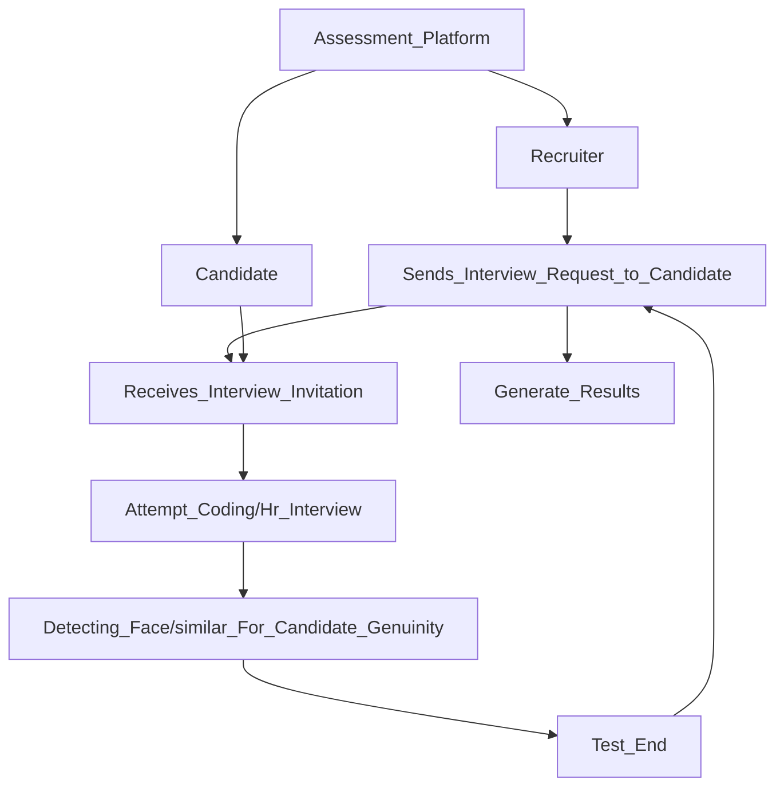
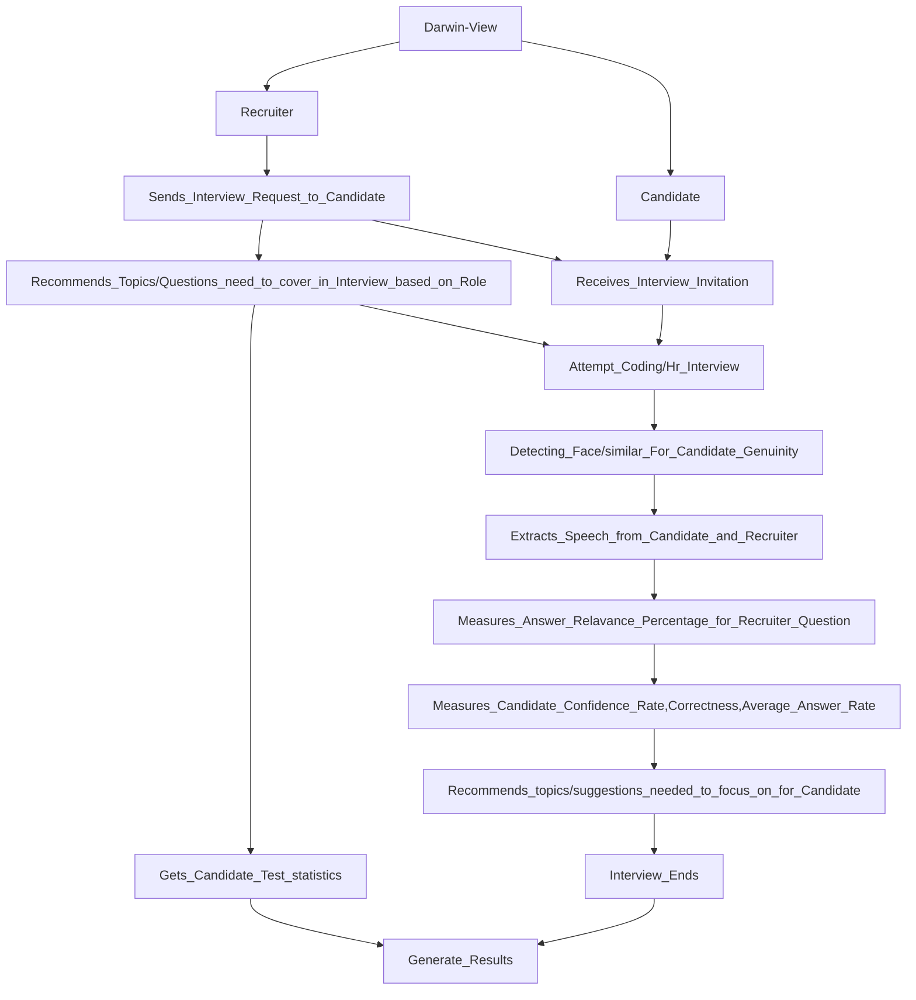

# Darwin-View
`Darwin-View` is an Intelligent Interview System(IIS) which enables a high-end 1:1 interview expereince in the assessments.     
>More formally even if recruiter make a mistake of wrong hire but AI won't.

Foremost let us take a quick look on ' traditional 1:1 inerview system ' , by the below diagram.

 Here is the glance of ` Darwin-View `  which enhanced with AI to automate interview experience.

> [!TIP]
> If you want to take a look at full picture of online recruitemt process, Visit Here https://bit.ly/DarwinBox_Assessments.

Sailent Features of Darwin-View
  
   

- [X] Creates Assessment Platform for 1:1 Interview Session.  
- [ ] Extract speech from candidate  which are answered, Extract speech from recruiter as well and outputs the answer relevance rate for total interview from the candidate data.  
- [ ] Includes candidate confidence rate, average answer speed, correctness, test statistics etc.
- [ ] Recommends the improvements/skill to work on from interview to candidate.
- [ ] Recommend topics to the recruiter that have to be cover in the interview based on role.

